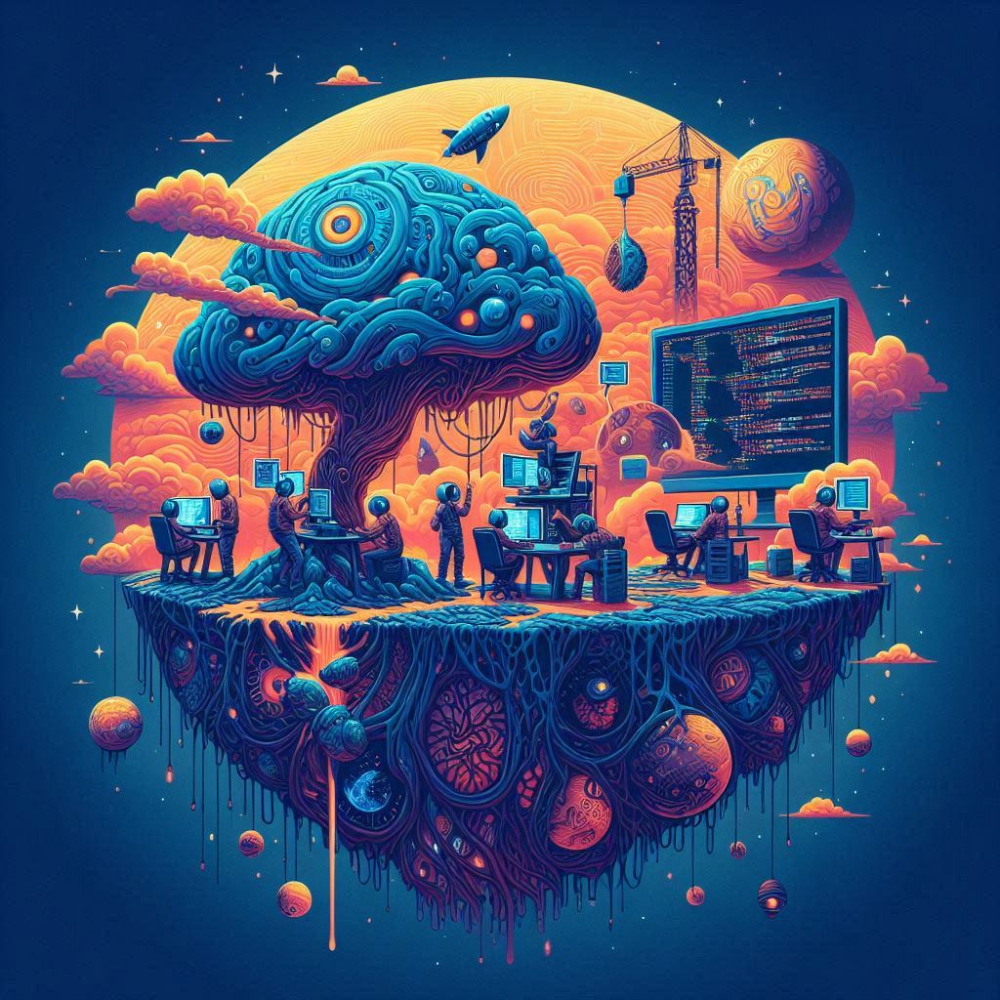

# Welcome to the Neueda Generative AI JAM Session

## Introduction
In this JAM session, we will explore the exciting world of Generative AI and its
applications. In this session, we will be focusing on the use of Gen AI in the world of 
building, testing, and deploying applications.

Your session today will comprise of a series of challenges that will address different capabilities of Generative AI.

Your instructor will guide you through the challenges and provide you with the necessary resources and support to complete them successfully.

Each challenge can be found in a subfolder in the this Git repository.

## Pre-requisites
In order to complete this session, you will need to have the following:

- The ability to clone this repository to the machine you are using for the JAM session
- The ability to install and run different tools and applications (if you are using one of our VMs, then these will be pre-installed)
- Access to at least one Developer centric GenAI tool such as Github CoPilot, SourceGraph Cody, or Amazon Q. 

## Setting up your VM Environment
If you are using a VM, then complete the following steps:

### Clone the Repository
1. Using your virtual machine, open your preferred browser and navigate to this page http://go.neueda.com/jam. You have probably already done this since you are reading the instructions! But make sure you are doing this from the virtual machine browser, not your local machine.
2. At the top of this Web page in BitBucket, click the **Clone** button.
3. Click **Clone** again.
4. Copy the URL.
5. In your virtual machine, create a new folder called **C:\GenAIJam**.
6. Using **Windows Explorer**, right click on your **c:\GenAIJam** folder, and then click **Git Bash here**.
7. At the **Git bash terminal**, right click, and then click **Paste** to paste in the git clone command, and then press **Enter**.

### Set up GenAI Tools
1. If you do not already have one, create a PERSONAL Github account
2. Open VS Code
3. Follow the instructions here to sign in to Copilot:

[https://go.neueda.com/setup](https://go.neueda.com/setup)

4. Check the course website for details of how to use the other tools.

## Project Teams - Playing to win or playing to learn?

You will be placed into groups of 3-4 people. This will be done relatively quickly, so please be prepared to work with people you don't know. Points will be awarded for each challenge that you complete. You can decide as a project team whether you want to work to win, or work to learn. You will learn either way, but your approach to the session will be different if you are just trying to win, vs, wanting to just learn together. There is no right or wrong approach, just different approaches. You will need to decide as a team which approach you want to take.

## Structure of the Day

Your instructor will guide you through the challenges and provide you with the necessary resources and support to complete them successfully. However, for those of you who would appreciate a heads up, the rough plan will be as follows:

Morning Session:

* Introduction to the session and the challenges
* Overview of the tools and the capabilities that they have
* Break out into teams for the first set of challenges

Break for lunch

Afternoon Session:

* The final challenge
* Scores will be calculated and announced
* Prizes (if you're lucky!) will be given out!

Note that your instructor may change this schedule based on the needs of the group. So please don't hold them to it!

## Morning JAM Session

### Challenge 1 - [No Readme](challenges/no-readme/readme.md)
This challenge involves an application that has no readme file. Your task is to create a suitable readme file for the application.

**100 points**

### Challenge 2 - [No Tests](challenges/no-tests/readme.md)
This challenge involves the same app as challenge 1. There are no tests however, so your challenge is to create a suitable set of unit tests for the application. Do not go beyond unit tests.

**400 points**

### Challenge 3 - [Find and Fix a Bug](challenges/find-and-fix-a-bug/README.md)
This application has a bug in it. Your task is to find the bug and fix it!

**200 points**

### Challenge 4 - [Upgrade Required](challenges/upgrade-required/readme.md)
This application was last touched in 2021 and is using an old version of the software. Can you upgrade it to the latest version?

**400 points**

### Challenge 5 - [Improve Performance](challenges/improve-performance/Readme.md)
This application is slow and inefficient. Your task is to improve the performance of the application.

**200 points**

### Challenge 6 - [Fix an Unresponsive Website](challenges/fix-an-unresponsive-website/README.md)
This is a problematic React application. It has a dodgy menu option. Can you sort it out?

**300 points**

### Challenge 7 - [Upgrade Required](challenges/upgrade-required/readme.md)
This is an old Perl app that needs to be upgraded to Python. Can you take on the challenge with the help of AI?

**500 points**

## Afternoon JAM Session

### Challenge 8 - I need an App!
This is the final challenge of the day. In this challenge you will create an application from scratch!

**1000 points**
